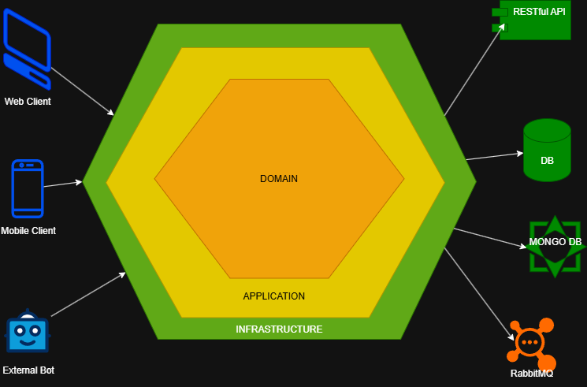

# kanionland-character-service

A Microservice to handle Kanionland's TTRPG custom character system, data and operations, where the
heavier and complex calculations will be centralized. This will be focused on character creation,
upgrades, stat and level progression, inventory operations, damage calculation, etc.

## Installation

1. Clone the repository:
   ```bash
   git clone

2. Ensure the following prerequisites are installed:
    - Java 11 or higher
    - Maven 3.6 or higher

3. Set the current Spring profile to local:
   Linux/macOS
   ```bash 
   export SPRING_PROFILES_ACTIVE=local
   ```
   Windows
   ```cmd
   set SPRING_PROFILES_ACTIVE=local
   ```

4. Build the project using Maven:
   ```bash
   mvn clean install
   ```
5. Run the application:
   ```bash
   mvn spring-boot:run -Dspring.profiles.active=local
   ```
6. Access the application at `http://localhost:8000`.

## Implementation Details

- This service is a will perform the requested operations coming from BFF components, holding the
  ruleset, operations, validations and database integration logic. Due to that, the project will
  hold the entity definition for characters, inventory, etc., while providing the necessary ports
  and adapters to interact with external components when needed.
- The project is structured using Spring Boot and follows best practices for RESTful API design.
- Hexagonal Architecture principles are applied to ensure maintainability and scalability.
    - This approach is preferred than Clean Architecture as the size of the microservice is not
      expected to hold too many operations or concerns, while still providing a clear separation of
      concerns and a better maintainability.
    - The business logic doesn't represent a high complexity for the system, so using a Clean
      Architecture approach could lead to over-engineering.
    - Hexagonal Architecture is also focused on separation of concerns through ports and adapters,
      bringing easier adaptation to external consumers, services and frameworks.
- Endpoint definition is provided through API First contracts using OpenAPI/Swagger.
- The project includes unit and integration tests to ensure code quality and reliability, relying
  mostly on JUnit and Mockito.

## Scope

- This Microservice will only be in charge of Character System operations for Kanion-Land TTRPG.
- Access, authentication and proper format will be handled by the expected BFFs consuming this
  service.
- In contrast, this component will have a series of handles for executing and validating operation
  commands, while integrating directly with the database through JPA repositories
  
- The Character domain was defined based on all the information that it could hold, defining several
  entities that hold information that could be reused for different characters, making more flexible
  the creation and customization of said
  characters. 

## High-level component design

- Following Hexagonal architecture and finding scenarios where Design Patters are suitable for their
  usage, the following structure was
  defined 
- Controllers will be the link to the BFF to perform operations exposed to the users.
- Ports and Adapters will allow decoupling and responsibility separation, making the system easier
  to adapt to external consumers, services and frameworks.
- Handlers will be the initial point for defining processes as a Chain of Responsibilities, allowing
  the system to execute operations in a flexible and dynamic way.
- Some of these handlers also involve strategies, as some operations and calculations depend on
  Character values, such as Race, current statistics, levels, rank, etc.
- A set of JPA Repositories are also defined to communicate with the database, defined through the
  previously defined domain schema. 